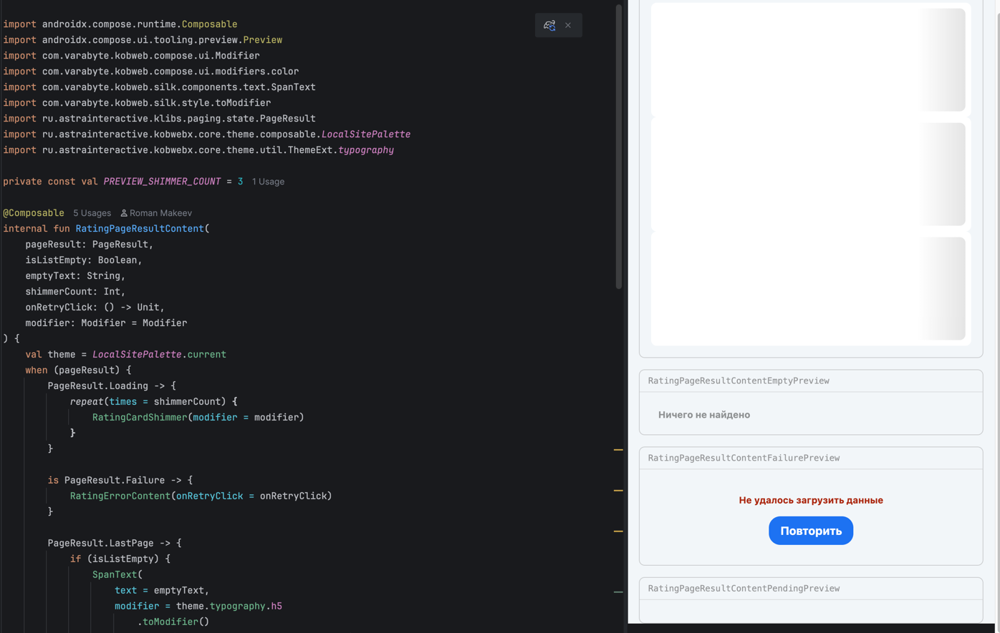
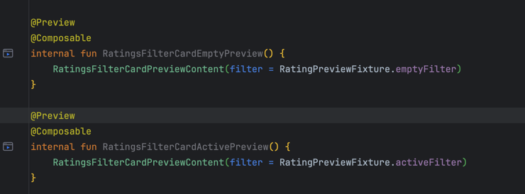
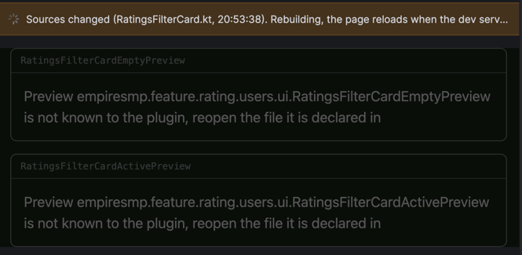
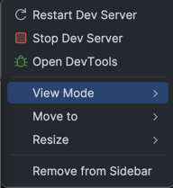
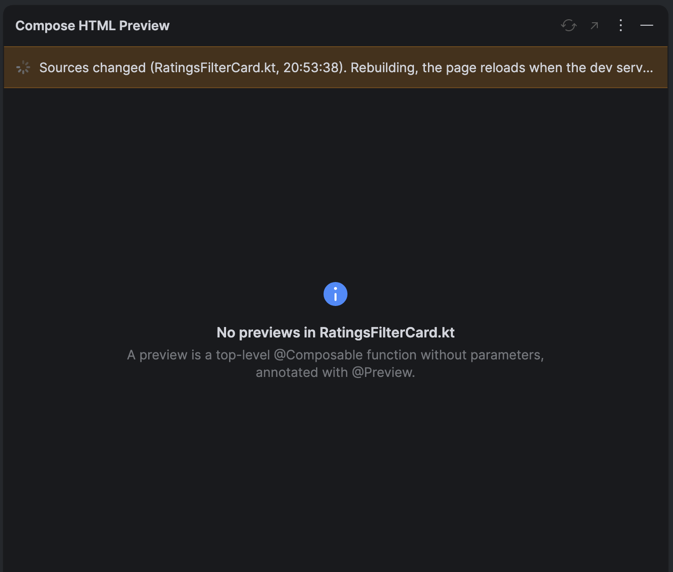

<p align="center">
  
</p>

<h1 align="center">Compose HTML Preview</h1>

<p align="center">
  <strong>Preview <a href="https://github.com/JetBrains/compose-multiplatform#compose-html">Compose HTML</a> (DOM)
  composables right inside IntelliJ IDEA — zero configuration.</strong>
</p>

<p align="center">
  
  
  
  <a href="LICENSE"></a>
</p>

<p align="center">
  <a href="#-installation">Installation</a> ·
  <a href="#-quick-start">Quick start</a> ·
  <a href="#-how-it-works">How it works</a> ·
  <a href="#-development">Development</a> ·
  <a href="#-support-us">Support</a>
</p>

<p align="center">
  
</p>

The official Compose preview renders through the Android backend and cannot draw DOM. This plugin renders your
composable in the IDE's embedded browser instead — real DOM, real CSS, real Silk styles.

## ✨ Features

- 🖼 **The tool window follows the editor.** Select a Kotlin file and every top-level parameterless
  `@Preview @Composable` in it is rendered together, in source order.
- ⚙️ **No setup at all.** The module that serves the previews is picked from the Gradle structure of the project —
  no preview module to write, no registry to maintain, no page to serve.
- 🧬 **The preview app is generated for you** into `build/` directories and passed to the run through a Gradle init
  script. Not a single file of your project is touched.
- 🚀 **The dev server is managed for you** — started when it is missing, reused when it already answers, stopped when
  you switch modules or close the project.
- 🎯 **Gutter icons** on every preview function jump straight to that preview on the page.
- ♻️ **Live reload with a staleness banner** — save a file, the bundle recompiles and the page reloads; the banner
  tells you whether what you are looking at is current.
- 🕸 **Kobweb aware.** Previews of a Kobweb library are served as a route of a real Kobweb site, so they get the
  `@App` root of that site: theme and Silk exactly as in production.
- 🔍 **Honest states.** Every non-rendering situation is a card that says what is going on and why, never an empty
  panel.

## 📦 Installation

The plugin is not on the JetBrains Marketplace yet — a listing is coming. Until then, install it from disk:

**From a release**

1. Download `compose-html-preview-<version>.zip` from the
   [Releases](https://github.com/makeevrserg/MVIKotlin-Decompose-Plugin/releases) page.
2. In the IDE: **Settings → Plugins → ⚙️ → Install Plugin from Disk…** and pick the ZIP.
3. Restart the IDE.

**From source**

```bash
git clone https://github.com/makeevrserg/MVIKotlin-Decompose-Plugin.git
cd MVIKotlin-Decompose-Plugin
./gradlew :plugin:buildPlugin
```

The distribution lands in `plugin/build/distributions`; install it from disk as above.

**Requirements:** IntelliJ IDEA **2026.2** or newer (build 262+). JDK 25 is needed only to build the plugin.

## 🚀 Quick start

1. Open a project that has a Kotlin/JS browser target depending on Compose HTML — a plain Kotlin/JS module or a
   Kobweb site both work.
2. Mark a composable as a preview. Top level, no parameters:

   ```kotlin
   @Preview
   @Composable
   fun ButtonPreview() {
       Button(attrs = { onClick { } }) { Text("Click me") }
   }
   ```

3. Click the gutter icon next to the function, or open the **Compose HTML Preview** tool window from the right
   toolbar.
4. That is it. The plugin picks the module, starts its dev server, generates the page and renders your previews.
   Save the file to see it reload.

<p align="center">
  
</p>

## ⚠️ Worth knowing

- The `main` of the module that renders the previews is left out of the compilation of the preview run. If that file
  also declares something else the module needs, the run fails with a compilation error in the Run tool window; move
  the `main` into a file of its own.
- A dev server started outside the IDE, from a terminal for example, is adopted as it is. It was built without the
  generated page, so the tool window says that the server does not serve it; press **Restart Dev Server** to replace
  it with one the plugin builds and runs.
- Only the server the module recorded for itself is adopted. Anything else answering on the same address — the
  Kobweb server of another module of the build, which declares the same default port, or one left over from another
  project — is reported instead of used: its page knows nothing about the previews of this module. The tool window
  names that program, with its process id and the command that ends it, and leaves the ending to you.

## ♻️ Stale previews

Any edit of a Kotlin source in the project marks the page as stale: a yellow banner says which file changed and when.
The plugin does not compute the dependency graph, so a preview is considered affected by any Kotlin change. When the
dev server finishes rebuilding and the page live-reloads, the banner turns green with the reload time. If the banner
stays yellow, check the Run tool window — the rebuild has probably failed with a compilation error.

<p align="center">
  
</p>

## 🎛 Tool window actions

- **Refresh Preview** reloads the page and re-checks the dev server.
- **Open in Browser** opens the current page URL in the system browser. This is the fallback when JCEF is not
  available, for example under Remote Development.
- Gear menu: **Restart Dev Server**, **Stop Dev Server**, **Open DevTools**.
- The footer, next to the state of the dev server, carries a **Support the author** link that opens the ways of
  supporting the plugin.

Only runs started by the plugin are stopped, whether by **Stop Dev Server**, by a switch to another module or by
closing the project; a dev server started from a terminal is left untouched.

<p align="center">
  
</p>

## 🔬 How it works

```text
selected file → previews scanned → module picked → sources generated → dev server started → page rendered in JCEF
```

<details>
<summary><strong>Step by step, from a selected file to a rendered page</strong></summary>

1. **The tool window follows the editor.** When a Kotlin file is selected, its top-level parameterless
   `@Preview @Composable` functions are collected and shown together, in source order — like the official Compose
   preview. Editing the file rescans it, so a new preview appears without any click.
2. **Nothing runs while the tool window is hidden.** No scan, no dev server. Opening it renders the current file
   right away.
3. **The module is picked from the Gradle structure** of the project, the way the official Compose preview finds the
   Gradle module of a file. Nothing is configured. See *Which module renders the previews* below.
4. **The preview application is generated** into the `build` directories of the modules involved and passed to the
   run through a Gradle init script. No file of your project is touched, and no other build sees the generated
   sources.
5. **The dev server is started** in the Run tool window if it is not answering yet: `kobwebStart -t` for a Kobweb
   application, `jsBrowserDevelopmentRun --continuous` for a plain Kotlin/JS module. Its origin is read from the
   output of the run (`Loopback: http://localhost:8305/`, `A Kobweb server is now running at http://localhost:8086`).
6. **The page is loaded in JCEF** with the previews of the file in the query:

   | Module | URL |
   |---|---|
   | Plain Kotlin/JS | `http://localhost:{port}/compose-html-preview.html?preview={fqn,fqn}` |
   | Kobweb | `http://localhost:{port}/compose-html-preview?preview={fqn,fqn}` |

   Without the `preview` parameter the same page shows every preview it knows, so it doubles as a gallery.

7. **Gutter icons jump to a preview.** Clicking one opens the tool window and appends `#<fqn>` to the URL, so the
   page scrolls to that preview.
8. **Saving reloads.** The dev server runs in continuous mode, so a save recompiles the bundle and the page
   live-reloads.

</details>

<details>
<summary><strong>Which module renders the previews</strong></summary>

The plugin takes the Gradle module the selected file belongs to and decides from the tasks the last Gradle sync
recorded:

| The file is in | Rendered by | Port |
|---|---|---|
| A **Kotlin/JS module with a browser target** (`js { browser() }`) | the module itself, turned into an application for the run | a free one in 8300–8399 |
| A **Kobweb library** | a Kobweb application of the build that depends on it | `server.port` of `.kobweb/conf.yaml` |
| A **module without a Kotlin/JS target**, previews shared with other platforms for example | a module that depends on it, by the rows above | as above |
| Nothing that qualifies | — | the tool window says what was found and why |

Why each row works the way it does:

- **Kotlin/JS module.** For the preview run the plugin adds `binaries.executable()` and leaves the `main` of the
  module out of that compilation, because the generated page brings its own. The port is picked from the 8300–8399
  range so a preview never collides with the real application of the project.
- **Kobweb library.** It cannot render its own components: the code that registers the styles of Silk components is
  generated for Kobweb applications only. Among the applications that depend on the module, one whose Gradle path
  contains `preview` wins, otherwise the shortest path — so the same one is picked every time. The generated page
  becomes a route of that site, which is why previews get its `@App` root: theme and Silk exactly as in production.
- **Nothing qualifies.** A Gradle sync that has not finished yet gives its own message; press **Refresh Preview**
  once it is done.

A dev server that already answers is reused instead of started again, and the server the plugin started for the
previous module is stopped — so the plugin owns at most one dev server per project. Closing the project stops that
server too: a run started by the plugin never outlives it.

</details>

<details>
<summary><strong>What the tool window shows in every state</strong></summary>

Anything that is not a page is a card in the shape the platform uses for empty and failed states: an icon, one line
saying what is going on and the detail under it.

| Icon | Title | When |
|---|---|---|
| Spinner | Looking for previews | the selected file is being scanned |
| Spinner | Looking for a module | the Gradle structure is being read for a module that can render the file |
| Spinner | Starting the dev server | the Gradle task of that module is running |
| Spinner | Waiting for the dev server | the plugin is polling the port of a server that has not answered yet |
| Spinner | Loading the preview | the page is being fetched; a dev server that is rebuilding answers only when it is done |
| — | *the page* | the browser loaded the page and the page identified itself |
| Information | No file selected | no editor file is selected |
| Information | No previews in … | the file declares no `@Preview` function |
| Information | Previews of … are not compiled to Kotlin/JS | they are in `jvmMain` or another source set that never reaches the page |
| Error | Nothing can render this preview | no module of the build can serve the file; the detail says why |
| Error | The dev server failed | the Gradle run failed; **Refresh Preview** tries again |
| Error | The preview page could not be loaded | the browser could not load the address: connection refused, an HTTP error, and so on |
| Error | The dev server does not serve the preview page | the address answered with something that is not the generated page |

<p align="center">
  
</p>

Three rules behind the table:

- **A page is shown only when it is really there.** Switching editor tabs drops the page immediately, and a new one
  goes on screen only once the browser reports that it loaded *and* the page itself answered that it is the
  generated one.
- **A server that does not serve the page is named, not faked.** A dev server that was already running was built
  without the preview page, and a single page application answers *every* path with the shell of the real site — so
  the address returns HTTP 200 and renders nothing. The generated page therefore names itself in the document title,
  and a load that never shows that title becomes the last row of the table. **Restart Dev Server** builds and starts
  the server again with the page in it.
- **The browser gets room only while it shows a page.** The embedded browser is a Swing component inside a Compose
  panel — a hole cut into the canvas that replaces whatever is drawn where it sits. Hiding it would only leave the
  background of the window showing through, so it is given no room at all while a card is up. That is what keeps a
  message from turning into an empty rectangle, and why the page is fetched while the card is still there.

**Refresh Preview** hands the address back to the browser and loads it again, which is how a page that failed comes
back.

</details>

<details>
<summary><strong>What the plugin generates</strong></summary>

Everything generated lives under `build/compose-html-preview` of the module it belongs to, so it is ignored by
version control, removed by `clean` and never mixed into your sources:

| File | Where | What it is |
|---|---|---|
| `kotlin/composehtmlpreview/generated/<module>/PreviewRegistry.kt` | every module that owns previews the picked module can see | compiled into that module, so `internal` previews work: only the object that dispatches them is public |
| `kotlin/composehtmlpreview/generated/PreviewPage.kt` | the picked module | the page itself |
| `PreviewMain.kt` + `compose-html-preview.html` | the picked module, plain Kotlin/JS | entry point and host page |
| `ComposeHtmlPreviewRoute.kt` with `@Page("/compose-html-preview")` | the picked module, Kobweb | the page as a route of the site |
| `compose-html-preview.init.gradle` | the picked module | the init script that adds those source directories to the build |

The init script is passed to the preview run as `--init-script`, so it affects nothing else: not your build files,
not the Gradle sync of the IDE, not a build you start yourself.

Every preview on the page is a card of its own: a header naming it and a body with room around the composable, so
several previews of one file do not run into each other.

Previews are collected from the source sets that end up in the Kotlin/JS compilation — `commonMain`, `jsMain` and the
`main` of the `kotlin("js")` plugin — and never from tests. The generated sources are rewritten before every launch,
and only when their content actually changed: a preview you add is on the page after the next recompilation, while
switching between two files recompiles nothing.

</details>

<details>
<summary><strong>Kobweb projects</strong></summary>

Kobweb components depend on Silk, whose styles are registered by the entry point the Kobweb Gradle plugin generates
for an application, so previews of a Kobweb library are served by a Kobweb application of the build. The plugin adds
its page to that application as a `@Page("/compose-html-preview")` route, which the Kobweb code generation picks up
from the generated source directory like any page of the site, and runs `kobwebStart -t`; the port comes from
`server.port` in `.kobweb/conf.yaml` of the module.

The Kobweb server is a separate process that outlives the Gradle run, so stopping the run alone would leave the
server on the port. The plugin does what `kobwebStop` does, without Gradle: it reads the process id from
`.kobweb/server/state.yaml` of the module, asks the process to terminate and kills it after 10 seconds if it has
not. This also works while the project is closing, when no Gradle task can run any more. The plugin also re-checks
the port when the Gradle task finishes successfully, so a server that keeps running is shown as running.

</details>

## 🛠 Development

```bash
./gradlew :plugin:runIde        # sandbox IDE with the plugin
./gradlew :plugin:buildPlugin   # distribution into plugin/build/distributions
./gradlew :plugin:verifyPlugin  # IntelliJ Plugin Verifier
./gradlew detekt                # static analysis
./gradlew test                  # unit tests of the plain Kotlin components
```

Requirements: IntelliJ IDEA 2026.2 or newer, JDK 25 to build.

<details>
<summary><strong>Module layout</strong></summary>

`:plugin` holds `plugin.xml`, the resources and the IntelliJ entry points: the line marker contributor, the gutter
action, the tool window factory, the startup activity and the project service. Everything else lives under
`:components`. A component with an `api` module is plain Kotlin: it compiles against the stdlib and coroutines
bundled with the platform, knows nothing about IntelliJ and is tested with `kotlin.test`. Its `intellij` module
holds the adapters that implement the ports of the `api` module with platform APIs.

| Component | `api` | `intellij` |
|---|---|---|
| `core` | coroutine features, `Lifecycle`, `PreviewDispatchers` | `ProjectDependencies`, EDT dispatchers |
| `host` | host models, `PreviewHostSelector`, `PreviewProjectStructureReader` and `PreviewHostLocator` ports | IDE module model readers |
| `server` | `DevServerLauncher` (one run as a cold flow), `DevServerController`, output parsing, `GradleTaskRunner` port | `ExternalSystemUtil` runner |
| `harness` | generators of the registry, the page and the init script, the plan behind them, `ProjectPreviewSource` port | |
| `preview` | `PreviewStore` contract, state, reducer, `PreviewFeature`, notifier and tool window ports | editor and tool window trackers, port implementations |
| `psi` | | `@Preview` detection on Kotlin PSI, project-wide preview scan |
| `ui` | | tool window panel, JCEF browser, actions |

Every component is merged into the plugin JAR through `pluginComposedModule` in `plugin/build.gradle.kts`.

</details>

## 🙏 Gratitude

- [Compose Multiplatform IDE plugin](https://github.com/JetBrains/compose-multiplatform/tree/v1.7.3/idea-plugin) for the gutter and Gradle orchestration approach
- [kotlin-js-preview-idea-plugin](https://github.com/sanyavertolet/kotlin-js-preview-idea-plugin) for proving Kotlin/JS previews in JCEF work
- [jetbrains](https://jetbrains.com) for IntelliJ

## 💜 Support Us

If this plugin helps you, consider supporting its development. The same options are one click away inside the IDE:
the **Support the author** link in the footer of the tool window.

<table>
<tr>
<td align="center" width="130">
<br/>
<sub><b>Telegram</b></sub>
</td>
<td align="center">
<a href="https://t.me/makeevrserg">

</a>
</td>
</tr>
<tr>
<td align="center" width="130">
<br/>
<sub><b>Bitcoin</b></sub>
</td>
<td>

```text
bc1q9a8dr55jgfae0mhevw3vvczegjv0khfp0ngrnv
```

</td>
</tr>
<tr>
<td align="center" width="130">
<br/>
<sub><b>Ethereum</b></sub>
</td>
<td>

```text
0x0BaAeEA44Ce08c8DC139224ff57563695B30d423
```

</td>
</tr>
<tr>
<td align="center" width="130">
<br/>
<sub><b>Boosty</b></sub>
</td>
<td align="center">
<a href="https://boosty.to/empireprojekt/donate">

</a>
</td>
</tr>
</table>

## 📄 License

[Apache License 2.0](LICENSE)
